<!-- Header -->

  

  

  
  

  

---

## 🚀 About me

- 🎓 Student at **Bauman Moscow State Technical University (BMSTU)**, department **IU5** — Information Systems and Technologies
- 💻 Full-stack developer, equally at home on the **backend** and the **frontend**
- 📱 Building native **iOS** and **Android** apps with real-time computer vision
- 🧩 Hard problems are a challenge I take on with pleasure
- ⚡ I love turning complex algorithms into elegant, efficient code

**What I do**

- ⚙️ **Backend** — REST APIs, server logic, authentication & sessions, performance
- 🎨 **Frontend** — responsive layouts, SPAs, state management, UX/UI
- 📱 **Mobile** — native iOS & Android, camera and speech processing
- 🗄️ **Databases** — schema design, query optimisation
- 🐳 **DevOps basics** — Docker, CI/CD, deployment
- 🤝 **Teamwork** — Git, code review, Agile

---

## 🧠 Programming languages I know & use

<table>
  <tr>
    <th></th>
    <th align="left">Language</th>
    <th align="left">What I use it for</th>
  </tr>
  <tr>
    <td></td>
    <td><b>Python</b></td>
    <td>Backends with Django &amp; Django REST Framework, data analysis and ML (pandas, scikit-learn)</td>
  </tr>
  <tr>
    <td></td>
    <td><b>Swift</b></td>
    <td>iOS apps with SwiftUI, Vision, AVFoundation and Combine</td>
  </tr>
  <tr>
    <td></td>
    <td><b>Kotlin</b></td>
    <td>Android apps with Jetpack Compose, CameraX and MediaPipe</td>
  </tr>
  <tr>
    <td></td>
    <td><b>TypeScript</b></td>
    <td>React SPAs with Redux Toolkit, a desktop app with Tauri, PWA</td>
  </tr>
  <tr>
    <td></td>
    <td><b>JavaScript</b></td>
    <td>Interactive web pages and front-end logic</td>
  </tr>
  <tr>
    <td></td>
    <td><b>C++</b></td>
    <td>Algorithms and data structures</td>
  </tr>
  <tr>
    <td></td>
    <td><b>SQL</b></td>
    <td>PostgreSQL schema design and query optimisation</td>
  </tr>
  <tr>
    <td> </td>
    <td><b>HTML &amp; CSS</b></td>
    <td>Responsive, adaptive layouts</td>
  </tr>
</table>

---

## 🛠️ Tech stack

**⚙️ Backend**

**🎨 Frontend**

**📱 Mobile**

**📊 Data & ML**

**🧰 Tools**

---

## 🌟 Featured projects

<table>
  <tr>
    <td width="50%" valign="top">
      <h3>🤟 <a href="https://github.com/Fen1x678/sign_language_interpretation_on_camera">GestureControl</a></h3>
      
Sign language translation, touch-free gesture control and speech-to-text on iPhone and Android. You teach the app your own signs, and it recognises them from the camera in real time.

      

        
        
        
        
        
      

      
📱 iOS 17+ · 🤖 Android 8.0+ (<a href="https://github.com/SignSpeech/Android">SignSpeech/Android</a>) · 🚧 beta

    </td>
    <td width="50%" valign="top">
      <h3>🗜️ <a href="https://github.com/Fen1x678/estimating_data_volume_for_archiving_RIP_backend_2025">Archive Size Estimator</a></h3>
      
Full-stack web app that estimates how much space a web project will take after archiving, comparing compression methods: LZW, Huffman, RLE, LZMA, JPEG and MP3.

      

        
        
        
        
        
        
      

      

        <a href="https://github.com/Fen1x678/estimating_data_volume_for_archiving_RIP_backend_2025">Backend</a> ·
        <a href="https://github.com/Fen1x678/estimating_data_volume_for_archiving_RIP_frontend_2025">Frontend</a> ·
        <a href="https://github.com/Fen1x678/estimating_data_volume_for_archiving_RIP_async_archive_calc_service_2025">Async service</a> ·
        <a href="https://fen1x678.github.io/estimating_data_volume_for_archiving_test_frontend/">Live demo</a>
      

    </td>
  </tr>
</table>

---

## 📊 GitHub stats

  
  

Cards are generated daily by a GitHub Action from public repositories.

---

## 🎯 Current goals

- [x] Build a full-stack web app: Django REST + React/TypeScript + Docker
- [x] Release a mobile app for iOS and Android
- [ ] Take GestureControl out of beta
- [ ] Build an application with a microservice architecture
- [ ] Go deeper into **Docker & Kubernetes**
- [ ] Level up in **System Design**
- [ ] Contribute to open-source projects
- [ ] Launch my own SaaS product

---

## 💡 Development philosophy

> *"A good developer isn't the one who knows everything, but the one who knows how to find solutions and keep learning."*

<b>🚀 From idea to implementation</b>

  

<!-- Footer -->

  

